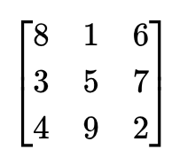

# Zero Knowledge Magic Square
****
## Introduction
After reading module 1 and 2 of the [ZK Book](https://www.rareskills.io/zk-book) from RareSkills, I decided to write some circuits to prove my practical knowledge of Circom and Groth16 SNARK. This is just one small step in the long road ahead for me to master zero knowledge proofs.

Here you will see a Circom implementation of a circuit that proves that a magic square is known. From zero to verifing the proof on chain, I will guide you to take the steps explaining not only the practical aspects but also some theory so we know what we are doing. 

Hope you find this repository helpful in your ZK journey.
****
## Context and problem
The intention of this problem is simple, I want to prove that I know the solution of a magic square but of course, this is ZK!, without revealing the actual solution to the verifier or anybody having the proof.

At this point you might be thinking... what in the world is a magic square??

A **magic square** is an `n x n` grid of distinct numbers where the sum of each **row, column, and both diagonals** is the same **magic sum**. The magic sum is given by the formula:  

<div align="center">
  
</div>

For example, in a **3×3 magic square**:  

<div align="center">
  
</div>

Each row, column, and diagonal add **15**.

As you see, it is pretty straightforward and easy, but it has enough maths to serve its learning purpose. I just don't want to write circuits that help me prove that I know the solution of an equation because it is a common example (see [Vitalik's blog post](https://medium.com/@VitalikButerin/quadratic-arithmetic-programs-from-zero-to-hero-f6d558cea649))
***
## Set Up

In order to keep this document brief (as much as I can), the step-to-step explanation of what needs to be installed and the commands to do it is all in the [setup](setup.md) file.
****
## Introduction

We already defined the problem we want to solve (the constrains) and the maths behind it. In the following sections, we will go step-to-step exposing the theory and reasons behind each step.

First, we will write a Circom circuit to then compile it converting it to a R1CS (Rank One Constrain System). Then, as we will use the Groth16 zk-SNARK protocol, we need to generate a trusted setup and contribute to it (super cool thing). Finally, we will generate some proofs to verify them on our terminal and also **on-chain** using our own smart contract writen in Solidity.
****

## Writing Magic Square Circuit

### Background
`circom` allows us to write the `constraints` that define our arithmetic circuit. An arithmethic circuit is a circuit consisting of set of wires that carry values from a finite field and connect them to addition and multiplication gates `modulo p`(with `p` being a prime number and the bigger number of the finite field). In `circom`, they refer to wires as signals.

It might not be obvious how to convert our problem into an arithmethic circuit so I will show a simple example:

Constraints:

- `a * (b + 1) === c`
- `b === a * a`

Arithmetic circuit:


Note that this is not the exact representation that is used to diagram arithmetic circuits. In our case, signals are squares, and circles are gates. Most of the times, you will see arithmetic circuits represented as in this [image](https://external-content.duckduckgo.com/iu/?u=https%3A%2F%2Fwww.tutorialspoint.com%2Fdigital_circuits%2Fimages%2Ffull_adder.jpg&f=1&nofb=1&ipt=7630493c9fec8260c57cd5c16838f87815b153aa1eb165dd7f88ca0100ae1c49&ipo=images) (at least this is the formal way that I was taught in university to represent an arithmetic circuit).

The inverse process, going from and arithmetic circuit to equations, is called **flattening**(this is vocabulary you can encounter in other resources, so I think it's useful you know it).

But before we go on and write our constraints, there are a couple of things we need to know. 

Did you note that in my previous constraints I could have written just `a * (a * a + 1) === c`? 
And what about the `===`? Why not just `=`, as in a normal equation?

Well, there is a reason I did it that way: **Rank 1 Constraint System (R1CS)**

A Rank 1 Constraint System (R1CS) is an arithmetic circuit with the requirement that each equality constraint has one multiplication (and no restriction on the number of additions):

`(a_1*s_1 + ... + a_n*s_n) * (b_1*s_1 + ... + b_n*s_n) + (c_1*s_1 + ... + c_n*s_n) = 0`

This makes the representation of the arithmetic circuit compatible with the use of bilinear pairings, but we won't go into details with that.

What is important here is that the set of constraints describing the circuit is called rank-1 constraint system (R1CS).

From now on, I will just say R1CS.

⚠ Note that the representation of the R1CS from before is not accurate (it has an extra element), I will go deeper on it soon...

About the `===`: in Circom `===` is used to [generate constraints](https://docs.circom.io/circom-language/constraint-generation/), but think of it as an equality sign `=`.


### Implementation

Now that we know how to write constraints, we will think about the problem we want to solve (magic squares) and write its constraints.
We have 5 simple constraints:

1) Given an `n x n` matrix, the magic sum is:

<div align="center">
  
</div> 

2) Each row adds the magic sum: 

<div align="center">
  
</div> 

3) Each column adds the magic sum:

<div align="center">
  
</div> 

4) The main diagonal adds the magic sum:

<div align="center">
  
</div> 

5) The anti diagonal adds the magic sum:

<div align="center">
  
</div> 

Now we need to put this math into Circom code.

#### Constraints in Circom

1) Magic Sum:
```circom
signal magicSum;
signal sizeSquared;
sizeSquared <== size * size;
magicSum <== (size * (sizeSquared + 1)) / 2; 
```

Why are we allowed to use the division operator (`/ 2`)? Remember that we are working in a finite field `p`, so division does not exist as we are doing everything `modulo p`, however, Circom allows writing the division operator but behind the scenes is multiplying the inverse of the divisor.

Once we have the `magicSum` assigned to a `signal`, we can write the rest of the constraints.

2) Each row adds `magicSum`:

Here the logic is simple, we have a `size x size` (being `size` a constant) matrix and we need to check that all the elements of all rows add the magic sum.

```circom
signal input values[size][size];

for(var i = 0; i < size; i++){
        var sumRow = 0;
        for(var j = 0; j < size; j++){
            sumRow += values[i][j];
        }
    sumRow === magicSum;
}
```

3) Each column adds `magicSum`:

```circom
for(var i = 0; i < size; i++){
        var sumCol = 0;
        for(var j = 0; j < size; j++){
            sumCol += values[j][i];
        }
    sumCol === magicSum;
}
```

4 and 5. Main and anti diagonal add `magicSum`:

These two are together as the checks are done in the same for loop.

```circom
// Checking diagonals
var mainDiagonal = 0;
var antiDiagonal = 0;
for(var i = 0; i < size; i++){
    // Main diagonal check
    mainDiagonal += values[i][i];

    // Anti diagonal check
    antiDiagonal += values[i][size - i - 1];
}
mainDiagonal === magicSum;
antiDiagonal === magicSum;
```

Logic is simple here so won't explain much.

You can check the final implementation of our Circom circuit in the [magic_square.circom](/circuits/magic_square.circom) file.

The "boring" part has been covered to this point, now it's time to enjoy the magic of zkSNARKs.
****

## Compiling the Circuit

This is pretty straightforward. We will compile our Circom circuits into R1CS. The specific information of the following commands can be found [here](https://docs.circom.io/getting-started/compiling-circuits/).

```bash
circom circuits/magic_square.circom --r1cs --wasm --sym -o outputs/
```
But... what happens under the hood of this compilation?

### Gates to R1SC


****
## Trusted Setup

### Overview

As we are going to use the Groth16 zkSNARK protocol, we will need to create a **trusted setup**. This is my favorite part of the Groth16 protocol, not because it is something super incredible and efficient (we need one trusted setup **per circuit**) but because when I first learned the protocol, all the previous concepts and the ZK magic clicked here.
