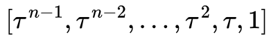
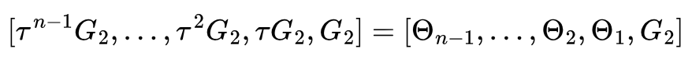

# Zero Knowledge Magic Square
****
## Introduction
After reading module 1 and 2 of the [ZK Book](https://www.rareskills.io/zk-book) from RareSkills, I decided to write some circuits to prove my practical knowledge of Circom and Groth16 SNARK. This is just one small step in the long road ahead for me to master zero knowledge proofs.

Here you will see a Circom implementation of a circuit that proves that a magic square is known. From zero to verifing the proof on chain, I will guide you to take the steps explaining not only the practical aspects but also some theory so we know what we are doing. 

Hope you find this repository helpful in your ZK journey.
****
## Context and problem
The intention of this problem is simple, I want to prove that I know the solution of a magic square but of course, this is ZK!, without revealing the actual solution to the verifier or anybody having the proof.

At this point you might be thinking... what in the world is a magic square??

A **magic square** is an `n x n` grid of distinct numbers where the sum of each **row, column, and both diagonals** is the same **magic sum**. The magic sum is given by the formula:  

<div align="center">
  
</div>

For example, in a **3×3 magic square**:  

<div align="center">
  
</div>

Each row, column, and diagonal add **15**.

As you see, it is pretty straightforward and easy, but it has enough maths to serve its learning purpose. I just don't want to write circuits that help me prove that I know the solution of an equation because it is a common example (see [Vitalik's blog post](https://medium.com/@VitalikButerin/quadratic-arithmetic-programs-from-zero-to-hero-f6d558cea649))
***
## Set Up

In order to keep this document brief (as much as I can), the step-to-step explanation of what needs to be installed and the commands to do it is all in the [setup](setup.md) file.
****
## What's Next

We already defined the problem we want to solve (the constraints) and the maths behind it. In the following sections, we will go step-to-step exposing the theory and reasons behind each step.

First, we will write a Circom circuit to then compile it converting it to a R1CS (Rank One Constraint System). Then, as we will use the Groth16 zk-SNARK protocol, we need to generate a trusted setup and contribute to it (super cool thing). Finally, we will generate some proofs to verify them on our terminal and also **on-chain** using our own smart contract written in Solidity.
****

## Writing Magic Square Circuit

### Background
`circom` allows us to write the `constraints` that define our arithmetic circuit. An arithmethic circuit is a circuit consisting of set of wires that carry values from a finite field and connect them to addition and multiplication gates `modulo p`(with `p` being a prime number and the bigger number of the finite field). In `circom`, they refer to wires as signals.

It might not be obvious how to convert our problem into an arithmethic circuit so I will show a simple example:

Constraints:

- `a * (b + 1) === c`
- `b === a * a`

Arithmetic circuit:


Note that this is not the exact representation that is used to diagram arithmetic circuits. In our case, signals are squares, and circles are gates. Most of the times, you will see arithmetic circuits represented as in this [image](https://external-content.duckduckgo.com/iu/?u=https%3A%2F%2Fwww.tutorialspoint.com%2Fdigital_circuits%2Fimages%2Ffull_adder.jpg&f=1&nofb=1&ipt=7630493c9fec8260c57cd5c16838f87815b153aa1eb165dd7f88ca0100ae1c49&ipo=images) (at least this is the formal way that I was taught in university to represent an arithmetic circuit).

The inverse process, going from and arithmetic circuit to equations, is called **flattening**(this is vocabulary you can encounter in other resources, so I think it's useful you know it).

But before we go on and write our constraints, there are a couple of things we need to know. 

Did you note that in my previous constraints I could have written just `a * (a * a + 1) === c`? 
And what about the `===`? Why not just `=`, as in a normal equation?

Well, there is a reason I did it that way: **Rank 1 Constraint System (R1CS)**

A Rank 1 Constraint System (R1CS) is an arithmetic circuit with the requirement that each equality constraint has one multiplication (and no restriction on the number of additions):

`(L_1*w_1 + ... + L_n*w_n) * (R_1*w_1 + ... + R_n*w_n) + (O_1*w_1 + ... + O_n*w_n) = 0`

This makes the representation of the arithmetic circuit compatible with the use of bilinear pairings, but we won't go into details with that.

What is important here is that the set of constraints describing the circuit is called rank-1 constraint system (R1CS).

From now on, I will just say R1CS.

⚠ Note that the representation of the R1CS from before is not accurate (it has an extra element), I will go deeper on it soon...

About the `===`: in Circom `===` is used to [generate constraints](https://docs.circom.io/circom-language/constraint-generation/), but think of it as an equality sign `=`.


### Implementation

Now that we know how to write constraints, we will think about the problem we want to solve (magic squares) and write its constraints.
We have 5 simple constraints:

1) Given an `n x n` matrix, the magic sum is:

<div align="center">
  
</div> 

2) Each row adds the magic sum: 

<div align="center">
  
</div> 

3) Each column adds the magic sum:

<div align="center">
  
</div> 

4) The main diagonal adds the magic sum:

<div align="center">
  
</div> 

5) The anti diagonal adds the magic sum:

<div align="center">
  
</div> 

Now we need to put this math into Circom code.

#### Constraints in Circom

1) Magic Sum:
```circom
signal magicSum;
signal sizeSquared;
sizeSquared <== size * size;
magicSum <== (size * (sizeSquared + 1)) / 2; 
```

Why are we allowed to use the division operator (`/ 2`)? Remember that we are working in a finite field `p`, so division does not exist as we are doing everything `modulo p`, however, Circom allows writing the division operator but behind the scenes is multiplying the inverse of the divisor.

Once we have the `magicSum` assigned to a `signal`, we can write the rest of the constraints.

2) Each row adds `magicSum`:

Here the logic is simple, we have a `size x size` (being `size` a constant) matrix and we need to check that all the elements of all rows add the magic sum.

```circom
signal input values[size][size];

for(var i = 0; i < size; i++){
        var sumRow = 0;
        for(var j = 0; j < size; j++){
            sumRow += values[i][j];
        }
    sumRow - magicSum === 0;
}
```

3) Each column adds `magicSum`:

```circom
for(var i = 0; i < size; i++){
        var sumCol = 0;
        for(var j = 0; j < size; j++){
            sumCol += values[j][i];
        }
    sumCol - magicSum === 0;
}
```

4 and 5. Main and anti diagonal add `magicSum`:

These two are together as the checks are done in the same for loop.

```circom
// Checking diagonals
var mainDiagonal = 0;
var antiDiagonal = 0;
for(var i = 0; i < size; i++){
    // Main diagonal check
    mainDiagonal += values[i][i];

    // Anti diagonal check
    antiDiagonal += values[i][size - i - 1];
}
mainDiagonal - magicSum === 0;
antiDiagonal - magicSum === 0;
```

Logic is simple here so won't explain much.

You can check the final implementation of our Circom circuit in the [magic_square.circom](/circuits/magic_square.circom) file.

The "boring" part has been covered to this point, now it's time to enjoy the magic of zkSNARKs.
****

## Compiling the Circuit

This is pretty straightforward. We will compile our Circom circuits into R1CS. The specific information of the following commands can be found [here](https://docs.circom.io/getting-started/compiling-circuits/).

```bash
circom circuits/magic_square.circom --r1cs --wasm --sym -o outputs/
```
Expected output:

<div align="center">
  
</div>

But... what happens under the hood of this compilation?

### Arithmetic Circuit to R1SC

An R1CS is a sequence of groups of three vectors (L, R, O), and the solution to an R1CS is a vector w (witness), where w must satisfy the equation L . w * R . w  - O . w = 0. `

Remember when I first mentioned R1CS?
`(L_1*w_1 + ... + L_n*w_n) * (R_1*w_1 + ... + R_n*w_n) + (O_1*w_1 + ... + O_n*w_n) = 0`

L, R and O are matrices that have `n` rows, where `n` is the amount of constraints, and `m` columns, where `m` is the amount of variables used in constraints + 1 (the constant variable).

From the previous compilation output, whe can see that our L, R and O will have:
- `13` rows (linear constraints).
- `28` columns (labels).

Our witness vector `w`, will have just one column and as many rows as columns L, R and O have.

All this theory sounds weird, specially when I showed you the final form of the R1CS first. We will continue with our simpler example (the one I graphed its arithmetic circuit):

- `a * (a^2 + 1) = c`

Where the constraints in the R1CS format were:

- `a * a = b`
- `a * (b + 1) = c`

So we now have to identify our L, R and O matrices. You might be wondering(or not :|), why those letters to identify matrices? 

Well, it has a reason.

- `L` stands for Left Hand Side (LHS from now on)  of the constraint.
- `R` stands for Right Hand Side (RHS from now on)  of the constraint.
- `O` stands for output.

As defined before: "a Rank 1 Constraint System (R1CS) is an arithmetic circuit with the requirement that each equality constraint has one multiplication (and no restriction on the number of additions)"

What divides the Left and Right side is the multiplication (`*`).

To build L, R and O, we have to recongnize the amount of rows `n` and the amount of columns `m`. Which is easy for this example:

- `n == 2` because we have two equality constraints.
- `m == 4` because we have three three variables (`a` as private input, `b` as intermediate variable, and `c` as public output)

Our witness vector will look like the following:
<div align="center">
  
</div>

And our L, R and O, will depend on how the constraints are formed. These matrices will only have scalar values as elements where 0 represents the absence of one of the variables in the part of the equality constraint and any other number, the times that a variable is present in the part of the equality constraint. This sounds confusing, I know, but the following example will make it crystal clear.

The following image shows our constraints with some colors to make it easy to visualize:

- The top constraint is green,
- the bottom constraint is red,
- the LHS with yellow background,
- the RHS with pink background,
- and, the O without distinctions (it's alone on the right side of the equalities)

<div align="center">
  
</div>

Construction of L, R and O is quite similar, so I will show the process for just one because the process for the others is analogous.

#### Constructing R

We already know that the size of the matrix is 2x4 (two rows, four columns), but we now have to know which values assign to our emmpty matrix.

Remember what I said, absense of the variable means 0 and presence of the variable means the scalar asociated with the variable. The order we will follow is the same order of the witness vector (`[1, a, c, b]`).

<div align="center">
  
</div>

As you can see, in the first row (for the green constraint) we placed 1 in the `a` field, because the scalar asociated with `a` is one in the first row. And only `a` has assigned a value because no other variable is present in the first RHS.

Then, in the second row (red constraint), we placed 1 in in the constant field and in `b` field. Same reasoning than before.

For L and, O I will just show the final result so you can check your own calculations.

<div align="center">
  
  
</div>

The R1CS equation is:

<div align="center">
  
</div>

Where L, R and O are 2x4 matrices, and w is a 4x1 vector.

<div align="center">
  
</div>

For a witness to be valid, the R1CS equation must be true.

At this point, the equation that I previously shown, has to make sense (I assume you have previous knowledge of matrix operations):
`(L_1*w_1 + ... + L_n*w_n) * (R_1*w_1 + ... + R_n*w_n) + (O_1*w_1 + ... + O_n*w_n) = 0`

#### Recap

Well, now we know how to convert an arithmetic circuit to a R1CS! Congrats, this is a huuuge step!

With witness for the R1CS, a prover can send the witness to the verifier and the verifier can now calculate the operations and see that if the equation is satisfied, the witness is valid!!!!!

Ok but...

You may be wondering, where is the zero-knowledge in this?
There isn't :), YET. All the answers to your questions are in the next section. Believe me!

****
## Trusted Setup

### Overview

As we are going to use the Groth16 zkSNARK protocol, we will need to create a **trusted setup** (phase 1). This is my favorite part of the Groth16 protocol, not because it is something super incredible and efficient (we need one trusted setup **per circuit**) but because when I first learned the protocol, all the previous concepts and the ZK magic clicked here.

Then, we will have to contribute to the trusted setup the information of the circuit (remember that Groth16 requires one trusted setup per circuit). Here something interesting occurs, the R1CS is converted into a QAP (**Quadratic Arithmetic Program**). This part involves a lot of math so, please, be patient when reading (phase 2).

For this section, prior knowledge of [Elliptic Curves over Finite Fields](https://www.rareskills.io/post/elliptic-curves-finite-fields) and [Bilineal Pairings](https://www.rareskills.io/post/bilinear-pairing) is assumed.

⚠ A good understanding of the [Discrete logarithm problem](https://www.youtube.com/watch?v=SL7J8hPKEWY) is key!

### Powers of Tau (phase 1)

A trusted setup is a mechanism ZK-SNARKs use to evaluate a polynomial at a secret value. 

Why a polinomial? One of the steps we haven't covered yet is converting a R1CS to a QAP. Wait till the next part and everything will make sense there. 

The creator of the trusted setup will generate a random secret tau value and will compute:

<div align="center">
  
</div>

Where `n` is the number of rows of the R1CS. In "phase 2", we will see why.

Then it will multiply each of those points with the generator point of a cryptographic elliptic curve group:

<div align="center">
  
</div>

Now anyone can take the Structure Reference String (SRS) and evaluate a degree `n` polynomial (or less) on tau.

This is called "trusted setup" because only the creator knows tau, which is the discreate log of the functions evaluated at tau, and we rely on the creator to delete tau and have no way to recover it.

For our project, we will be the creators of the trusted setup.

Start a new powers of tau ceremony, using the pairing-friendly elliptic curve `bn128`:
```bash
snarkjs powersoftau new bn128 12 pot12_0000.ptau -v
```

But wait, a "ceremony"? What does this mean?

To increase the security of the system and avoid relying on only one actor to generate tau and forevever delete it. Now actors are required also to "contribute" to the trusted setup by generating their own random scalars and forgetting them. 

Sequentially, all actors involved will generate their scalar and will multiply the powers of the scalar with the SRS of the last contributor. The last actor will end up with the final SRS, that will be used for proving.

This ceremony increases the system security because as long one contributor acts honestly and deletes its random scalar, the trusted setup is safe. All the other actors can be malicious, but it takes just one honest actor to be 100% safe.

So we will contribute again to the ceremony, simulating that we are other actor:
```bash
snarkjs powersoftau contribute pot12_0000.ptau pot12_0001.ptau --name="First contribution" -v
```

You will see something similar to this:

<div align="center">
  
</div>

You are now probably thinking: I get what `tauG1` is, but what about `tauG2`, `alphaTauG1`, and `betaTauG1`?

- `tauG2` is essentially the same than `tauG1` but multiplying tau with the generator point of a second cryptographic elliptic curve group.

<div align="center">
  
</div>

- `alphaTauG1` is a key element for proof security (don't confuse with `[alpha]_1`).

- `betaTauG1` is later used in the proving key (don't confuse with `[beta]_2`).

I won't go in much detail in how they are used for security, but these last two values essentially link the universal Powers of Tau setup to the final structured reference string (SRS) for Groth16. 

The final SRS for Groth16 is circuit specific, remember, and it allows us to value a **polynomial** at tau without knowing the actual value of tau.

### Phase 2

#### Introduction
For this section, in addition to all othe previous sections, some extra knowledge is needed.

The reader has to be comfortable with the following topics:

- **Lagrange Interpolations**. The minimum knowledge needed is [here](https://www.rareskills.io/post/python-lagrange-interpolation) in the ZK Book from RareSkills. However, a deeper understanding of this topis can be helpful when understanding why the proof generation in Groth16 is slow compared to others protocols (this is not the main reason, of course, multi-scalar multiplications and pairing based cryptography are). If you want to dive deep on the topic, I recommend [this video](https://www.youtube.com/watch?v=REnFOKo9gXs) from Lambda Class. 

- **Schwartz-Zippel Lemma**. Again, the ZK Book from RareSkills covers this topic well in [this chapter](https://www.rareskills.io/post/schwartz-zippel-lemma).

Additionally, at least superficial knowledge about **Fast Fourier Transformations (FFT)** would be nice for an optional part of this section that covers optimizations in the Groth16 protocol. This concept is used to optimize Lagrange Interpolations (R1CS to QAP).

#### Preparation

In order to prepare this phase 2 of the trusted setup we run:
```bash
snarkjs powersoftau prepare phase2 pot12_0001.ptau pot12_final.ptau -v
```

This step eliminates the non-public randomness of the setup (or *toxic waste*) and computes a predifined subset of the powers of tau.

#### R1CS to QAP
After preparation, we will execute the following command:
```bash
snarkjs groth16 setup outputs/magic_square.r1cs pot12_final.ptau magic_square_0000.zkey
```

This previous command will:
1) Convert R1CS to QAP (this section)
2) Evaluate QAP at SRS Powers of Tau
3) Embed Phase 2 Contributions (to ensure soundness)
4) Generate Proving & Verification Keys

Now, let's finally see what is a QAP.

A Quadratic Arithmetic Program is a representation of a R1CS as a set of polynomials.

It is derived using Lagrange interpolation on a Rank 1 Constraint System. Unlike an R1CS, a QAP can be tested for equality in `O(1)` time, instead of in `O(n)` time with `n` being the number of rows, via the Schwartz-Zippel Lemma. This is a huge improvement in efficiency, but we need R1CS because they are a developer friendly representation of the constraints.

Using polynomials instead of matrices to test equality is only possible because the group of vectors under addition in a finite field is homomorphic to the group of polynomials under addition in a finite field.

<div align="center">
  
</div>

Where:
- `L(v)` is the polynomial resulting for doing the Lagrange interpolation of vector `v`.


Let's see then how to go from R1CS to QAP.

To do this, we will use a R1CS of the same size that the previous example, where L, R and O are 2x4 matrices, and w is a 4x1 vector.

We will directly generalize the method because to show an example, I will have to explain the Lagrange interpolation algorithm and run it many times. I want to keep this as succint as possible.

Let's define L, R, O and w as:

<div align="center">
  
  
  
</div>

<div align="center">
  
</div>

We will split each column of L, R and O to use those values to do a Lagrange interpolation with `(1, 2, ..., n)` in the x axis.

Let's take L as example, as the process is analogous for R and O.

We will do a Lagrange interpolation for the following columns to get a polynomial for each column.

<div align="center">
  
</div>

Where `u_i` are polynomials of degree `n-1` because the Lagrange interpolation returns for a set of `n` points,  the unique lowest-degree polynomial of at most degree `n-1` that interpolates them.

So now, we can express:

<div align="center">
  
</div>

And this representation is possible because of the following property.

Scalar multiplication:

<div align="center">
  
</div>

Where:
- `L(v)` is the polynomial resulting for doing the Lagrange interpolation of vector `v`,
- and, `lambda` is a scalar.

So now, we can represent the R1CS equation, as a polynomial equation:

<div align="center">
  
</div>

Where `Lw` was previously defined, and:

<div align="center">
  
  
</div>

Then the R1CS converted into a QAP will look like the following:

<div align="center">
  
</div>

But... WAIT!!!

We know that a polynomial multiplication results in a product polynomial whose degree is the sum of the degrees of the two polynomials being multiplied together.

As the interpolation of `L` and `R` are of degree `n-1`, the polynomial product should result in a `2n-2` degree polynomial. However, the interpolation of `O` is a `n-1` degree polynomial.

We need to adjust that to balance the degrees.

We will calculate a polynomial `b(x)` such that adding it to the equation will balance it.

<div align="center">
  
</div>

`b(x)` will also be the result of interpolating the 0 vector. Which is doing the Lagrange interpolation of `(1, 0), (2, 0), (3, 0), (4, 0)`.

We need `b(x)` to interpolate the 0 vector so the polynomial transformation of `v1 * v2 = v3 + 0` (where * is the Hadamard product) respects the underlying vectors (interpolated vectors).

However, allowing the prover to introduce any `b(x)` introduces a security risk. The prover could pick any `b(x)` that balances the equation (which is the calculation the verifier does) but does not interpolate the 0 vector (`b(x) has to have roots at (1, 2, 3, 4) from 1 to n`).


To enforce `b(x)` to interpolate the 0 vector, we will now say that:

<div align="center">
  
</div>

This enforces `b(x)` to have the set roots of `{r_h} U {r_t}` (the union of roots of the polynomial product).

**Observations:**

We showed how a R1CS can be converted into a QAP, which allows us to quickly verify conmputations in `O(1)` time. 

This somehow looks like zero knowledge because the verifier can send a random value to the prover, expecting the prover to follow all the process explained before, so the prover computes the QAP and evaluates it on the random value, sends it to the verifier, so then the verifier just checks the equality.

This will hide the witness well, as sending a polynomial does not reveal the witness.

However, this has many security implications:

- Prover could use any set of polynomials that evaluated a that random value meet the equality requirement, and the verifier wouldn't notice.
- This is not **non-interactive**, which is part of the SNARK definition.

In the following section, we will show how all the security issues are eliminated with a trusted setup.

#### Evaluating QAP in Trusted Setup

#### Groth16 Trusted Setup & Security Considerations

****

## Compiling the Witness

****

## Proof Generation

***

## Proof Verification
